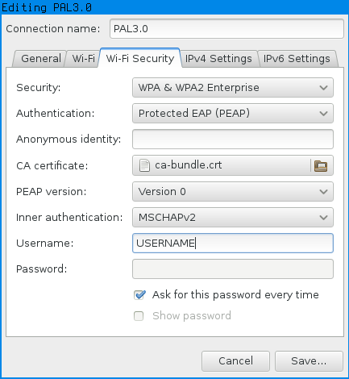

## Connect with Network Manager

Click on the wireless icon in your tray area. Select "Connect to Hidden Wi-Fi Network" or choose PAL3.0 and enter these settings.

- Network Name: "PAL3.0"
- Wireless Security: WPA & WPA2 Enterprise
- Authentication: Protected EAP (PEAP)
- Key Type (if present): TKIP
- Anonymous Identity: (leave blank)
- Domain: (leave blank)
- CA Certificate: No CA certificate is required
- PEAP Version: Automatic
- Phase2 Type / Inner Authentication: MSCHAPV2
- Identity / Username: Your Purdue Login
- Password: Your Purdue Password



Click save.

## Connect with iwd (iwctl)

These instructions will allow you to connect to PAL3.0 using iwd, the default network manager in Arch Linux

Edit the file `/var/lib/iwd/=50414c332e30.8021x` to resemble the following (fill in your own information for identity and password)

```
[Security]
EAP-Method=PEAP
EAP-PEAP-Phase2-Method=MSCHAPV2
EAP-PEAP-Phase2-Identity=*Purdue Username*
EAP-PEAP-Phase2-Password=*Purdue Password*

[Settings]
AutoConnect=true
```

After doing this, you should be able to connect to PAL by running `station *name* connect PAL3.0` in `iwctl`, where your wireless station name is found by running `device list`.
